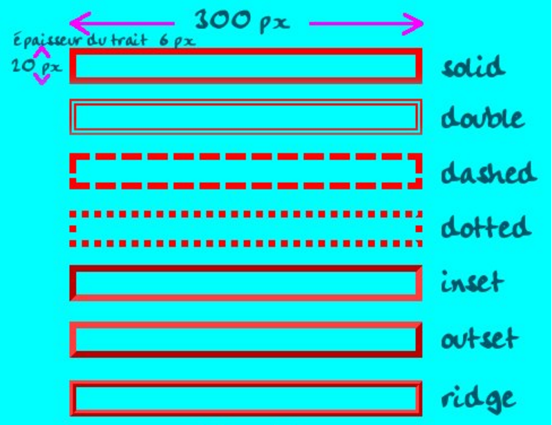

 <h2> Préparation atelier </h2> 

Nombres de participant : 4
 
Nombres d'intervenant : 3
 
Atelier ~ 1 h 30
 
Compétences: - Approches HTML  
             - Approches CSS  

Déroulement de l'atelier :  
    - Présentation de la formation  
    - Présentation de l'atelier  
    - Petite approche du langage HTML  
        * Réalisation ave le public de la page HTML  
        * Délimiter un espace de code sur thimble 
         (Pause 10 minutes)    
    - Petite approche du langage CSS  
        * Réalisation avec le public de la page CSS  
    - Conclusion + Présentation 2-3 projets des apprenants de la formation  

 <h1> Découverte du Html et du CSS </h1> 

    <h1> Introduction : </h1>
<h3> Nous Présenter : </h3>

 Nous sommes La Fabrik du numérique, c'est une formation de Codeur/Développeur Web. On apprend notamment a créer des pages internet. C'est la 1 er session qui se déroule actuellement à Moulins pour une durée de 8 mois dont 2 mois de stages en entreprises. Elle est dispensée par l'Association FACE Territoire Bourbonnais, elle lutte contre toutes formes d'exclusion, nous sommes une petite équipe de 23 apprenants de tout âges et issues de différents milieux professionnels .
 
FACE = Fondation Agir Contre l'Exclusion  

===============================================================================
<h1> I) Le HTML (Hyper Text Markup Language): </h1>
 
Nous allons vous expliquer les bases de la création d'une page internet. Dans un premier temps nous allons utiliser un éditeur de texte en ligne qui nous permettra la création de cette page. 
 (ex: Thimble.)  
Dans un second temps nous allons voir le squelette du site, c'est a dire le language que l'on appelle HTML, nous allons voir les balises obligatoires pour que notre code fonctionne, ainsi que certaines balises qui permettent une première mise en page de notre futur page internet.
 
 
Explication des quelques balises dans head que vous avez sur votre écran : (rester vague sur le sujet),
 
- La balise meta charset='utf-8' sert a dire a l'ordinateur que nous allons utiliser l'écriture utf-8.
 
    * Meta = Donnée lue par le navigateur
- La balise meta name="viewport" content="width=device-width,initial-scale=1" sert a donner une taille quand la page internet est charger sur un téléphone portable.
 
- La balise title donne un titre au chargement de la page, dans l'onglet en haut.
 
- La balise link rel="stylesheet" href="style.css" relie la page html avec la page CSS.
 
Beaucoup de site utlise souvent la même mise en forme présenter ci-dessous :

 <a href="https://www.facebook.com/faceterritoirebourbonnais/?fref=ts">page fb</a>
 <a href="http://www.gulli.fr/"> page gulli </a>
 
Exemple de construction d'une page internet.
 
 
Dans cette petite partie nous allons vous parler des différentes balises que vous allez utilisés ainsi que ce qu'est une balise.
 
 
Une balise HTML est un élément que l'on va ajouter au texte de départ pour dire au navigateur de quelle manière l'afficher. Elle n'est pas affichée telle quelle dans le navigateur, elle est interprétée par celui-ci. 
Elle est toujours délimitée par les signes < et >.
 
 

 
Exemple avec la balise P (paragraphe) :
 
 

  

 
===============================================================================
 
 <em> Coder un petit paragraphe dans le champ reserver </em> 

===============================================================================
 
La balise h1 : C'est le titre que vous voulez afficher
 
La balise h2 : C'est un sous-titre, c'est a dire qu'il sera écrit plus petit que le h1.
 
La balise h3 : C'est un sous titre, il sera ecrit encore plus petit que le h2
 
La balise h4 : C'est un sous titre, il sera écrit plus petit que le h3 
etc, jusqu'a h6 qui est la dernière des balises titres.
 
Ceci est la différence entre 3 balises h (titre) : 

 
===============================================================================

 <em> Coder un h1 et un h2 dans le champ reserver </em> 

===============================================================================
 
Nous pouvons aussi insérer des image dans notre page internet soit en enregistrant l'image et en mettant le chemin dans la balise ou soit en mettant directement l'url.
 
Vous vous demander surement ce qu'est un url :
 

  

 
Voila comment la balises image se compose :

  

 
Un exemple est plus parlant :

 
===============================================================================

 <em> Coder une image dans le champ reserver </em> 

===============================================================================
 
(Petite pause de 10 minutes)  
 
<h1> II) Le CSS (Cascading Steel Sheet) : </h1>
Maintenant nous allons voir les balises principales utilisées par le langage CSS. Le langage CSS permet une mise en page plus décorative, mais à condition de cibler l'élément que nous voulons mettre en page. Il existe quelques outils pour facilité la mise en page tel que :
     Bootstrap
     Flexbox
  
 
 
Pour pouvoir appliquer une propriété a un element il faut le cibler comme ceci :

 
 Je suis un paragraphe écris en rouge 
 
 
 
Maintenant nous allons voir les différentes propriété que nous avons vu ci dessus : 
 
 

 <strong> - background-color: orange;
  Elle permet d'insérer un fond de couleur orange. 
 </strong>
 

===============================================================================

 <em> Code background color </em> 

===============================================================================
 

 <strong> -color : white; 
 Elle permet de changer la couleur du texte. </strong> 

 

===============================================================================

 <em> Code  color </em> 

===============================================================================
 
 
 

 <strong> -Border : 1 solid #fff; 
  Elle permet d'inserer une bordure de 1 px d'épaisseur, cette bordure va etre remplit et de couleur #fff(noir)</strong> 

 
 
===============================================================================

 <em> Code border </em> 

===============================================================================
 
 

 
<h1> Conclusion : </h1>

En conclusion de cette petite activité, ce que nous vous avons présentés aujourd'hui n'est qu'une petite partie  des possibilités qu'offres ses 2 langages combinés. Nous pouvons vous faire voir avec plus de connaissance, les choses que vous pourriez réalisées.
 
 
===============================================================================

 <em> Voici quelques exemples de projets que nous avons réalisés <em> 

==============================================================================

 <strong> <h1> Live Coding </h1> </strong> 

<h1> <strong> Conclusion Final : </strong> </h1>

Il n'éxiste pas que ces 2 langages, par exemple pour faire des animations plus pousser on va utiliser le langage qui s'appelle Javascript. Et pour faire par exemple une zone menbres on va utilisé le Php.
